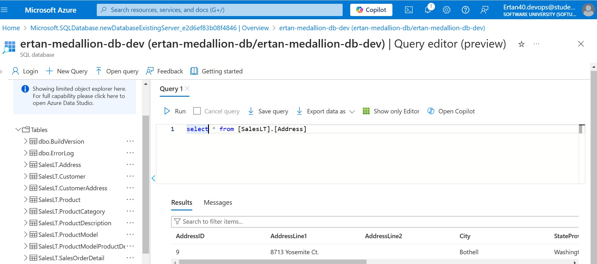

# Modern Data Engineering with Medallion Architecture using DBT, Databricks, Spark and Azure Cloud
 In this project, we setup and end to end data engineering using Apache Spark, Azure Databricks, Data Build Tool (DBT) using Azure as our cloud provider. This project illustrate the process of data ingestion to the lakehouse, data integration with ADF and data transformation with Databricks, and DBT.

1. <b>Architecture Diagram</b>:
    - <p></p>

## <ins>Current Environment</ins>
- Cloud Provider — Azure
- Database — Azure SQL
- Azure Data Lake
- Azure Key Vault
- Azure Databricks
- Azure Data Factory
- dbt (Data Build Tool)

## <ins>Setting up the stage on Azure Cloud</ins>
- Setting up the resource groups
  <p></p>
- Setting up the Storage Accounts on ADLS Gen2
- Setting up Azure Data Factory
- Setting up Azure Key Vault
- Creating SQL Database and Loading Sample Data
  <p></p>

## <ins>Data Integration with Azure Data Factory</ins>
Once all the setup is done, the next thing is to start creating pipelines on ADF.

- Connecting ADF to Azure SQL Database
  <p></p>
- Connecting ADF to Azure Data Lake Gen2
  <p></p>
- Adding Dynamic Content to the mix:
  Dynamic Content allows us to have a parameterised placeholder in our pipeline. We’ll be creating two datasets, TablesQuery and SqlTable each of which will help us fetch data from the SQL database dynamically and with parameters.
* TablesQuery: You can create a new dataset using the AzureSqlDatabase1 linked service created earlier to fetch the list of tables from the information schema on our DB dynamically. We create this dataset without selecting a table name.
* SqlTable: We’ll also need to create the SqlTable dataset using the AzureSqlDatabase1 linked service as well. This will also be done without selecting a table name but with parameters
  <p></p>
  <p></p>
- Going back to the pipeline, we’ll need to drag the lookup activity to the pipeline plane and in there, we’ll configure the lookup to use the TablesQuery dataset. In the settings section, we’ll select the Query radio button and pass in our query:
```sql
SELECT * FROM [ertan-medallion-db-dev].information_schema.tables
WHERE TABLE_TYPE = 'BASE TABLE' and TABLE_SCHEMA = 'SalesLT';
```
  <p></p>

- Iterating through the Lookup Results and ForEach Activity: The foreach activity give us access to individual records in the array of tables information from the lookup. So we drag and drop ForEach activity into the pipeline we configure the items using dynamic content.
- Dumping Table Records into the Bronze Layer: Once the ForEach activity is configured to use the @activity(‘Fetch All Tables’).output.value , the next thing is to configure the operations that will be happening to each of the items in the array. So we drag in Copy Data activity from the move and transform section into the for each sub-pipeline
<p></p>
- This is configured to use the second dataset created (SqlTable) which allows parameters to be passed into it. Here’s the source configuration.
<p></p>

- For the sink, we’ll need to create a Parquet File output from our Azure Data Lake Storage Gen2 . This will be leveraging on the already established linked service previously setup. We’ll pass in bronze into the file path and leave the directory and filename empty as they will be filled with parameters.
<p></p>
<p></p>
- In our pipeline, we configure the sink and pass in the required parameters specified (FolderName and FileName) and the file path will be bronze.
<p></p>
- The only thing left to do to complete the Copy Data Activity is to select the sink of ParquetFileOutput from the dropdown. Here are the parameters passed into the FolderName and FileName respectively

```sql
@formatDateTime(utcNow(), 'yyyy-MM-dd')

@concat(item().TABLE_SCHEMA, '.', item().TABLE_NAME, '.parquet')
```
<p></p>
- If you trigger (debug) this pipeline, you will be able to see the data dumped into the bronze layer correctly.
<p></p>
<p></p>

- So the data was uploaded successfully into the bronze layer.


  

